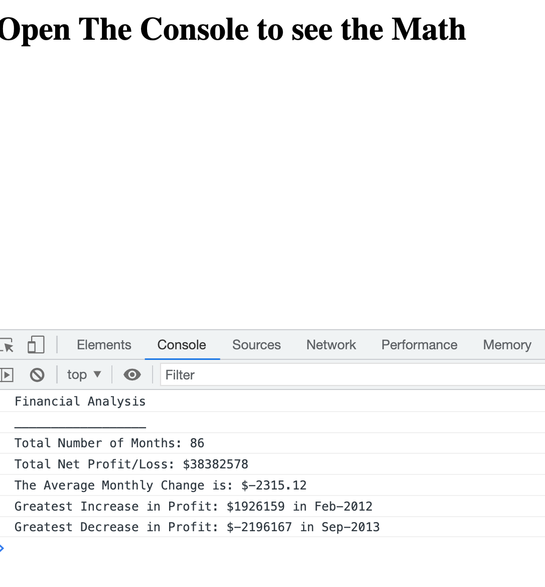

# Console-Finances
Module 4 Challenge

## Using JavaScript to work out financial information

Having been given some starter code in the form of an array i have to work out the following answers and have them print to console:

    Total Number of Months
    Total Amount
    Average Change
    Greatest Increase in Profits
    Greatest Decrease in Profits

## Links
* GitHub Repository:    https://github.com/RyzaT/Console-Finances
* GitHub Page:   https://ryzat.github.io/Console-Finances/

## Installation
N/A

## Usage
This repositorty is part of a bootcamp learning platform and is a part of my coursework. Please feel free to use it for your own studies.

## Credits
In order to complete this assignment i have mainly used the Stackoverflow and W3 Schools websites.

## License
Please refer to the LICENSE in the repo.

